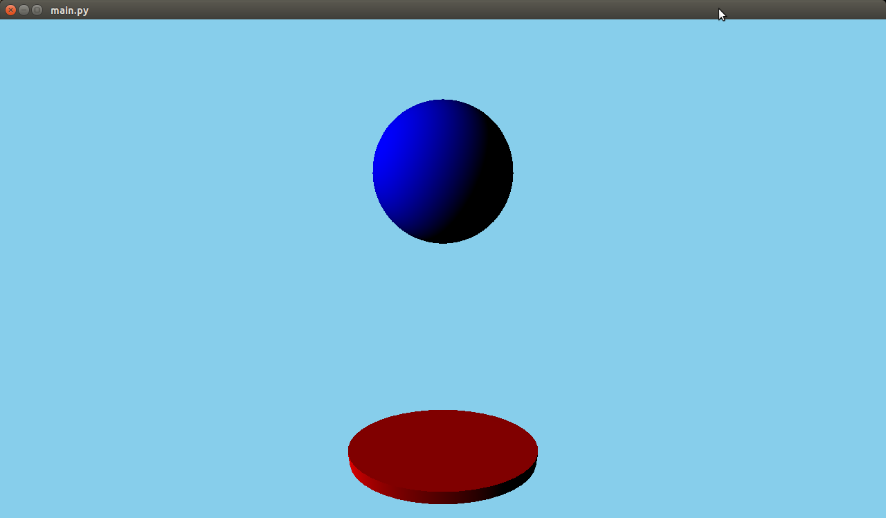
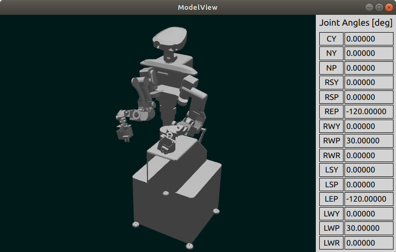

qt3D_robotViewer for Linux
===

# 1. 概要

&nbsp;

---

# 2. 対応環境

- Ubuntu18.04 64bit  
- python3.6以降  
- Qt 5  
- QtQuick3D 5  
- OpenGL 3.0以降  

以降、環境構築方法、利用方法を示す。  
各種パッケージ等以下の順にインストールしておく必要がある。

&nbsp;

---

# 3. python3.X  

## 3.1. python3インストール

Ubuntu18.04にはデフォルトでpython3も入っていて使えるため、あまり設定することはない。  
もしも入っていなかった場合は以下のようにインストールする。  
2020/2/6現在ubuntu18.04では, pythonという名前でインストールすると、
まだpython2.7がデフォルトで入る。  
python3以降のバージョンはpython3と入力してインストールするようになっている。　　

```
$ sudo apt-get install python3
```

pythonバージョンの確認。以下のようにPython 3.X.Xと出ることを確認。

```
$ python --version
Python 3.6.9
```

&nbsp;

## 3.3. pipのインストール

python関連のライブラリをインストールする場合、pipというインストールコマンドツールが便利である。  
pipをapt-getでインストール。

```
$ sudo apt-get install python-pip python3-pip
```

---

# 4. python用ビュワー環境の構築 


## 4.1. Qt Quick 3Dという選択肢

手軽にpythonからVRMLモデルを3D描画して動かせるツールはないか…？  
と探していて、最初にぱっと出てきたのは、python版openGLライブラリを使うという方法である。しかし、openGLの関数を直接書くのは手軽ではない。  

最近では、  
Qt for python  
というものがある。Qt(キュート,もしくはキューティー)自体は元々画面描画のツールのC++ライブラリとして発展していて、さらにpython向けのライブラリも出ていた。そこに最近(2019年〜)出ているのが、

Qt Quick 3D

というQtによる3D描画ライブラリがあるようだ。これを使用することで、従来のQtの書式(.qml)で３D描画できるとのこと。  
調べた感じこれが一番新しく、使いやすそうだったので、試したところUbuntuでもWindowsでもpython2.Xでもpython3.Xでも使えそうだったため、ビュワーとして採用することにした。

&nbsp;

## 4.2. Qt5のインストール

以下パッケージをインストール

```
sudo apt install qtbase5-dev qttools5-dev-tools qt5-default
```

&nbsp;

## 4.3. Qt Quick 3Dのインストール

Qtは既にインストール済みの状態として、

- OpenGLビュー用のqtライブラリ  
- Qt for pythonとなるpyside2
- Qt Quick 3D

を以下のようにインストールする

```
$ sudo apt install libqglviewer-dev-qt5
$ sudo pip install pyside2
$ sudo pip3 install PySide2
$ sudo apt-get install -y qml-module-qtquick-scene3d
$ sudo apt-get install -y qml-module-qt3d
```

&nbsp;

## 4.4. OpenGLのバージョン確認とQt Quick3D利用時の対処

OpenGLのバージョンを以下のようにして確認。

```
$ glxinfo | grep "version"
（↓以下出力例↓）
server glx version string: 1.4
client glx version string: 1.4
GLX version: 1.4
    Max core profile version: 4.5
    Max compat profile version: 3.0
    Max GLES1 profile version: 1.1
    Max GLES[23] profile version: 3.2
OpenGL core profile version string: 4.5 (Core Profile) Mesa 19.2.8
OpenGL core profile shading language version string: 4.50
OpenGL version string: 3.0 Mesa 19.2.8
OpenGL shading language version string: 1.30
OpenGL ES profile version string: OpenGL ES 3.2 Mesa 19.2.8
OpenGL ES profile shading language version string: OpenGL ES GLSL ES 3.20
    GL_EXT_shader_implicit_conversions, GL_EXT_shader_integer_mix, 
```

この出力のようにOpenGLのバージョン3.0では、QtQuick3Dのライブラリ関数QtSurfaceFormatが使えずサンプルなどを試すとエラーが出ることがある。  
OpenGLバージョン3.0環境でも無理矢理使うのであれば、実行前にMESA_GLのバージョンを3.3であると明言しておけばエラーなくいけるらしい。  

```
$ MESA_GL_VERSION_OVERRIDE=3.3 python3 (QtQuick3Dのサンプル).py
```

しかし、いちいちコマンドに書いて実行するのは使いづらい。  
調べるとpytnonコード実行時のQSurfaceFormatクラス利用時にバージョンを3.3と無理矢理書いておけば使えるそうだ。  
以下サンプルを試して欲しい。  

### ● python for Qt ＆ Qt Quick3D のサンプル

公式のサンプルmain.qml を以下よりダウンロード。

[https://doc.qt.io/qt-5/qtquick3d-simple-main-qml.html](https://doc.qt.io/qt-5/qtquick3d-simple-main-qml.html)  

さらにそのqmlコードを呼び出す以下のpythonスクリプトmain.pyを作成

``` python
import sys
import os
from PySide2 import QtWidgets
from PySide2.QtGui import QGuiApplication, QSurfaceFormat
from PySide2.QtQml import QQmlApplicationEngine
from PySide2.QtCore import QUrl

if __name__ == '__main__':
    os.environ["QT_QUICK_CONTROLS_STYLE"] = "Material"

    format = QSurfaceFormat()
    # format.setDepthBufferSize(24)
    # format.setProfile(QSurfaceFormat::CoreProfile);
    format.setVersion(3, 3);
    QSurfaceFormat.setDefaultFormat(format);

    app = QtWidgets.QApplication(sys.argv)
    # app = QGuiApplication(sys.argv)
    engine = QQmlApplicationEngine()
    engine.load(QUrl("simple_example.qml"))
    if not engine.rootObjects():
        sys.exit(-1)

    sys.exit(app.exec_())
```

上述のとおり、setVersionという関数でQSurfaceFormatクラスオブジェクトに対しGLのバージョンを3.3と指定している。  
作成したらsimple\_example.qmlとmain.pyと同じディレクトリにて以下を実行する。

```
$ python3 main.py
```



上図のような3Dのアニメーションが表示されれば環境構築成功！！

&nbsp;

---

# 5. ビュワー  

## 5.1. ビュワーの実行

コマンドプロンプトよりtemplate_viewRobot.pyを実行。  

```
$ pyhon3 template_viewRobot.py
```




&nbsp;

## 5.2. ビュワーの仕組み

以下に template_viewRobot.py の簡易的な処理フローのイメージを示す。


&nbsp;


以上  
