qt3D_robotViewer for Winodows10
===

# 1. 概要

Windows10 における本ビュワーの環境構築・利用方法を示す。  

&nbsp;

---

# 2. 対応環境

- windows10 for 64bit  
- python3.8  
- QtQuick3D ver.5  

以降、環境構築方法、利用方法を示す。  
各種パッケージ等以下の順にインストールしておく必要がある。

&nbsp;

---

# 3. python3.X  

## 3.1. python3.Xダウンロード

公式ページからインストーラ python-3.X.X-amd64.exe をダウンロードしてインストールする。

インストーラのダウンロード  
以下の公式ページのリンクより  
[https://www.python.org/downloads/](https://www.python.org/downloads/)  
pythonの公式ページが表示されると思うので、  

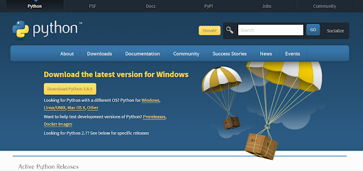  

下にスクロールして現れる以下のダウンロードリストから、最新のPython3.X.Xの「DownLoad」を選択(ここでは3.8.5)。  

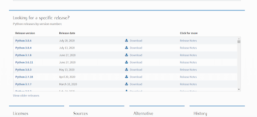  

するとインストーラのダウンロードが始まる。  

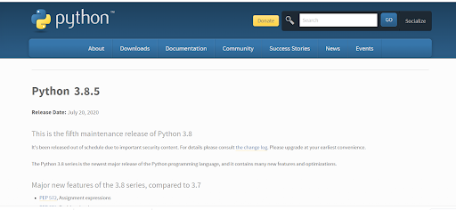  
  

&nbsp;

## 3.3. python3.Xインストール

前節でダウンロードしたインストーラpython-3.X.X-amd64.exeを実行。  
(ここではpython-3.8.5-amd64.exeの実行を例示する)  
一番下の「Add Python 3.X to PATH」にチェック。  
「Customize installation」を選択して次へ進む。  

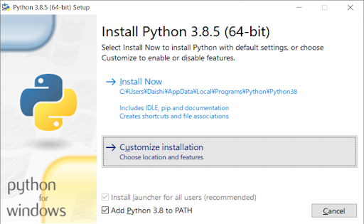  

次のページは以下のようにデフォルトのままで次へ進む。  

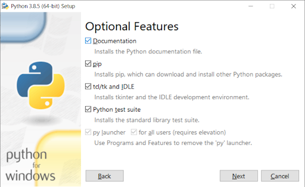  

Advanced Optionsのページにて、一番上のオプション「Install for all users」にチェックし、  
「Customize install location」にあるインストール先を「C:\Pthon38」と変更しとく。  
インストールを実行。  

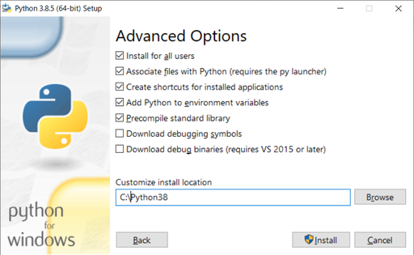  

インストール完了後、システム環境変数のPathに以下のパスが追加される。  

- C:\Python38\  
- C:\Python38\Scripts\  

インストール先の「C:\Python38\」にある、
python.exe のファイルのコピーを２つ作り、名前を python3.exe , python3.8.exe としておく。
同様に、「w」の付くpythonw.exe のファイルのコピーを２つ作り、名前を pythonw3.exe , pythonw3.8.exe としておく。

これによりコマンドプロンプトから「python3」と打って実行するといった、pythonのバージョンを指定した実行ができるようになる。

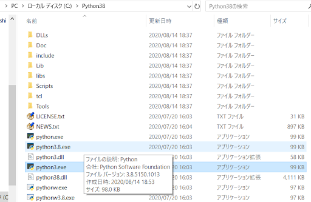

以上でpython3.Xのインストールは完了。  

&nbsp;

---

# 4. python用ビュワー環境の構築  

## 4.1. Qt Quick 3Dという選択肢

手軽にpythonからVRMLモデルを3D描画して動かせるツールはないか…？  
と探していて、最初にぱっと出てきたのは、PyOpenGLというpython版openGLライブラリを使うという方法である。しかし、openGLの関数を直接書くのは手軽ではない。  

最近では、  
Qt for python  
というものがある。Qt(キュート,もしくはキューティー)自体は元々画面描画のツールのC++ライブラリとして発展していて、さらにpython向けのライブラリも出ていた。そこに最近(2019年)出ているのが、

Qt Quick 3D

というQtによる3D描画ライブラリがあるようだ。これを使用することで、従来のQtの書式(.qml)で３D描画できるとのこと。  
調べた感じこれが一番新しく、使いやすそうだったので、試したところUbuntuでもWindowsでもpython2.7でもpython3.Xでも使えそうだったため、ビュワーとして採用することにした。

&nbsp;

## 4.2. Qt5のインストール

### 4.2.1. Qtのダウンロード  

Qt公式のインストーラのダウンロードページ  

[Qt公式ページへのリンク](https://www.qt.io/download-qt-installer?hsCtaTracking=99d9dd4f-5681-48d2-b096-470725510d34%7C074ddad0-fdef-4e53-8aa8-5e8a876d6ab4)  

の下の方にある「Download」ボタンを押してインストーラをダウンロードできる。  
2019/8月時点でダウンロードした時のファイル名は  
qt-unified-windows-x86-3.2.3-online.exe  
だった。このインストーラは、インストール実行するときにオンラインで必要なファイルをネットからダウンロードするタイプのようだ。  

&nbsp;

### 4.2.2. Qtのインストール

前節のQtの公式ページより、適当なメールアドレスでアカウントを登録しておく。

前節でダウンロードしたインストーラqt-unified-windows-x86-3.2.3-online.exeを実行。  
アカウント情報を求められたら、登録情報を入力して進む。  

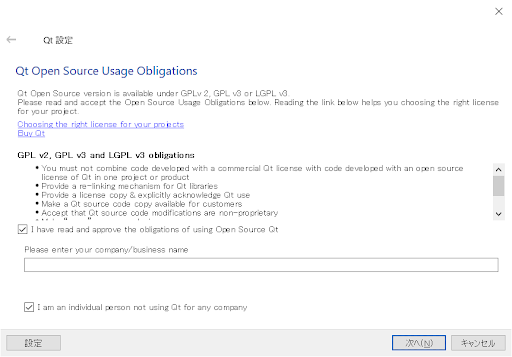  

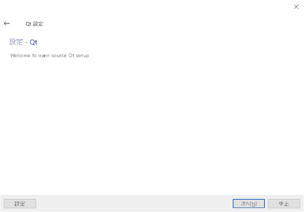  

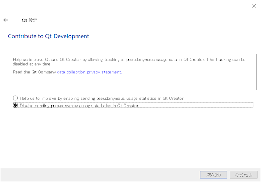  

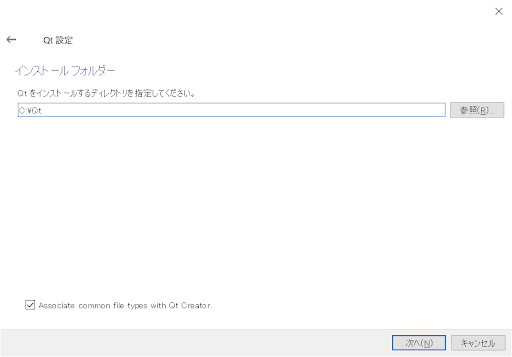  

コンポーネントの選択では、最新バージョンのQt 5.15.0をチェック。  
必要そうなものだけチェック(おそらくQt Quick 3Dだけでよいと思われる)。  
下の「Developer and Designer Tools」のチェックは全部外してインストールから除外しておいた。  

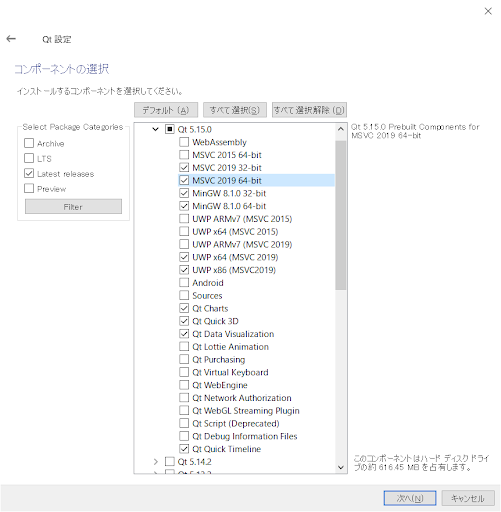

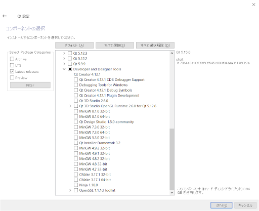

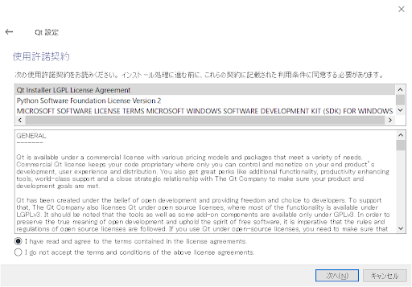

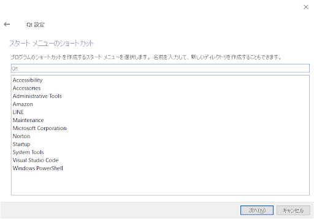

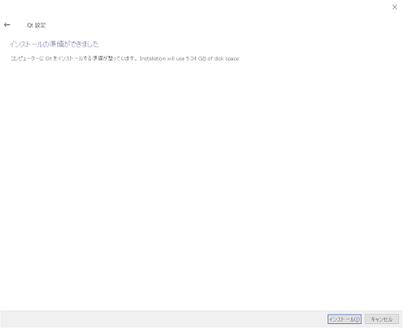

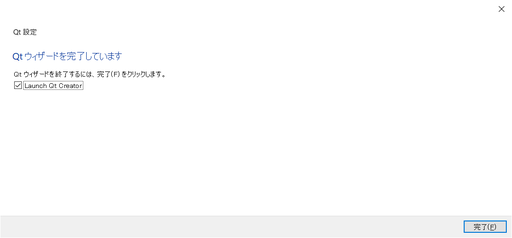

&nbsp;

## 4.3. PySideのインストール

PySideはpythonからQtを使用するためのライブラリである。  
以下のpysideのページから  
PySide2-5.15.0-5.15.0-cp35.cp36.cp37.cp38-none-win_amd64.whl  
をダウンロードする。  

[http://download.qt.io/snapshots/ci/pyside/5.15/latest/pyside2/](http://download.qt.io/snapshots/ci/pyside/5.15/latest/pyside2/)  

ダウンロードした.whlファイルの場所でコマンドプロンプトを開いて以下を入力  
(念のためWindowsを先に一回は再起動しておく)  

```
> python3 -m pip install PySide2-5.15.0-5.15.0-cp35.cp36.cp37.cp38-none-win_amd64.whl
```  

以下、成功時の実行結果の例  

```
Processing c:\users\daishi\documents\pc-setting\python\pyside2_python_for_qt\pyside2-5.15.0-5.15.0-cp35.cp36.cp37.cp38-none-win_amd64.whl
Collecting shiboken2==5.15.0
  Downloading shiboken2-5.15.0-5.15.0_2-cp35.cp36.cp37.cp38-none-win_amd64.whl (2.2 MB)
     |████████████████████████████████| 2.2 MB 598 kB/s
Installing collected packages: shiboken2, PySide2
Successfully installed PySide2-5.15.0 shiboken2-5.15.0
```

&nbsp;

もしくは、pythonインストール時にpipもインストールされているはずであるため、  
以下のように実行してインストールしてもよい。

```
> python3 -m pip install PySide2
Collecting PySide2
  Downloading PySide2-5.15.2-5.15.2-cp35.cp36.cp37.cp38.cp39-none-win_amd64.whl (136.3 MB)
     |████████████████████████████████| 136.3 MB 67 kB/s
Collecting shiboken2==5.15.2
  Downloading shiboken2-5.15.2-5.15.2-cp35.cp36.cp37.cp38.cp39-none-win_amd64.whl (2.3 MB)
     |████████████████████████████████| 2.3 MB ...
Installing collected packages: shiboken2, PySide2
Successfully installed PySide2-5.15.2 shiboken2-5.15.2
```

&nbsp;

### ● python for Qt ＆ Qt Quick3D のサンプル

公式のサンプルmain.qml を以下よりダウンロード。

[https://doc.qt.io/qt-5/qtquick3d-simple-main-qml.html](https://doc.qt.io/qt-5/qtquick3d-simple-main-qml.html)  

さらにそのqmlコードを呼び出す以下のpythonスクリプトmain.pyを作成

``` python
import sys
import os
from PySide2 import QtWidgets
from PySide2.QtGui import QGuiApplication, QSurfaceFormat
from PySide2.QtQml import QQmlApplicationEngine
from PySide2.QtCore import QUrl

if __name__ == '__main__':
    os.environ["QT_QUICK_CONTROLS_STYLE"] = "Material"

    format = QSurfaceFormat()
    # format.setDepthBufferSize(24)
    # format.setProfile(QSurfaceFormat::CoreProfile);
    format.setVersion(3, 3);
    QSurfaceFormat.setDefaultFormat(format);

    app = QtWidgets.QApplication(sys.argv)
    # app = QGuiApplication(sys.argv)
    engine = QQmlApplicationEngine()
    engine.load(QUrl("simple_example.qml"))
    if not engine.rootObjects():
        sys.exit(-1)

    sys.exit(app.exec_())
```

setVersionという関数でQSurfaceFormatクラスオブジェクトに対しGLのバージョンを3.3と指定している。  
作成したらsimple\_example.qmlとmain.pyと同じディレクトリにて、コマンドプロンプトもしくはエクスプローラのアドレスバーから以下を実行する。

```
> python3 main.py
```

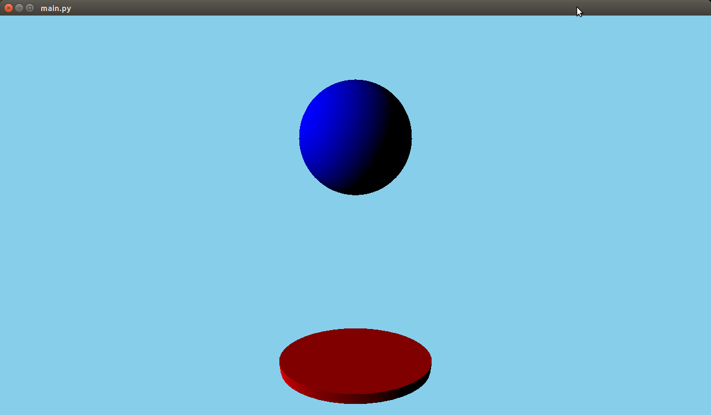

上図のような3Dのアニメーションが表示されれば環境構築成功！！

&nbsp;

# 5. ビュワー  

## 5.1. ビュワーの実行

template_viewRobot.pyを実行。  

```
$ pyhon3 template_viewRobot.py
```

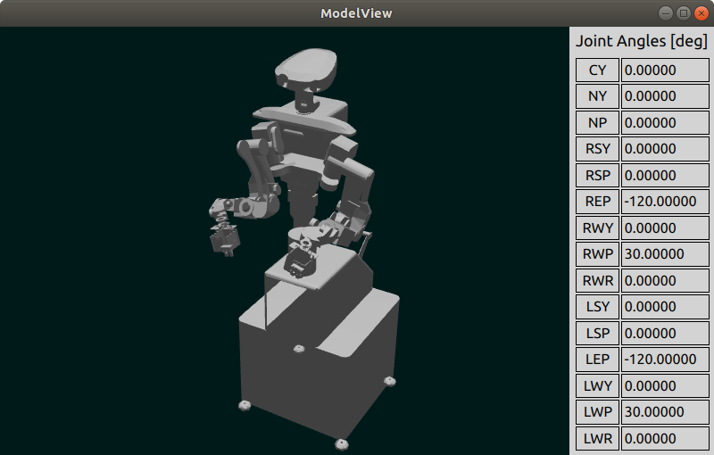

&nbsp;

## 5.2. ビュワーの仕組み

以下に template_viewRobot.py の簡易的な処理フローのイメージを示す。

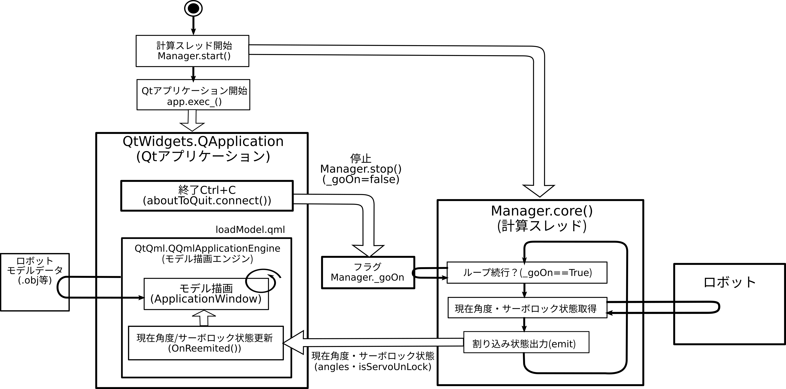

&nbsp;


以上  
